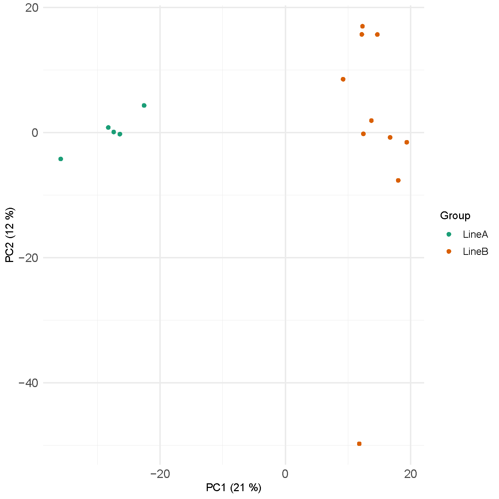
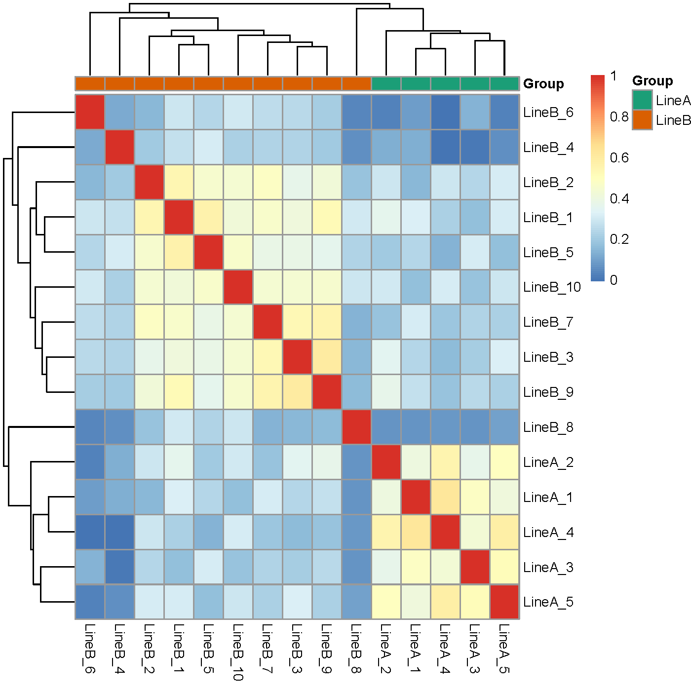

# RNAseq-QC-Miodin-Pipeline
🔬 End-to-end RNA-seq QC pipeline using miodin in R. Includes case–control design, exploratory data visualization (PCA, heatmap), outlier interpretation, and integration of public gene expression data.

# 🧬 RNA-seq Quality Control with `miodin` in R

This project demonstrates a complete RNA-seq quality control workflow using **R**, **Bioconductor**, and the **`miodin`** package. It includes public data parsing, sample annotation setup, case–control study design, and quality control assessment via PCA and heatmap clustering.

---

## 📌 Project Goals

- Build an end-to-end RNA-seq QC pipeline
- Interpret sample structure using PCA and correlation heatmaps
- Identify potential outliers and assess dataset reproducibility
- Apply structured workflows in R using the `miodin` framework

---

## 🧠 Skills Demonstrated

- RNA-seq preprocessing and study design
- Public data retrieval using `BioStudies`
- Case–control modeling with `miodin`
- PCA and hierarchical clustering interpretation
- Outlier detection and biological justification
- Project modularity via R Markdown and reproducibility

---

## 🗂️ Project Structure

```
RNAseq-QC-Miodin-Pipeline/
├── data/                        # Placeholder for public metadata (e.g., E-MTAB-7847)
├── figures/                    # QC visualization outputs
│   ├── pca_plot.png
│   └── heatmap_plot.png
├── src/
│   └── RNAseq_QC_Assignment.Rmd
```

---

## 📈 Figures

| PCA Plot | Sample Heatmap |
|----------|----------------|
|  |  |

---

## 📂 How to Reproduce

1. Clone the repository:
```bash
git clone https://github.com/YOUR_USERNAME/RNAseq-QC-Miodin-Pipeline.git
```

2. Open the R Markdown file in RStudio:
```R
src/RNAseq_QC_Assignment.Rmd
```

3. Install required packages:
```r
install.packages("miodin")
BiocManager::install(c("DESeq2", "edgeR", "limma", "BioStudies"))
```

4. Run the code or knit the document to HTML/PDF.

---

## 🔍 Dataset

- **Public dataset**: [E-MTAB-7847 – ArrayExpress](https://www.ebi.ac.uk/biostudies/studies/E-MTAB-7847)
- **Private dataset**: Omitted for confidentiality but used to demonstrate sample-level QC in `miodin`

---

## 👨‍💻 Author

**Fares Ibrahim**  
Bioinformatician | Systems Biology | Cancer Genomics  
🔗 [LinkedIn](https://www.linkedin.com) | 🌐 [GitHub](https://github.com/Fares77-afiy)

---

